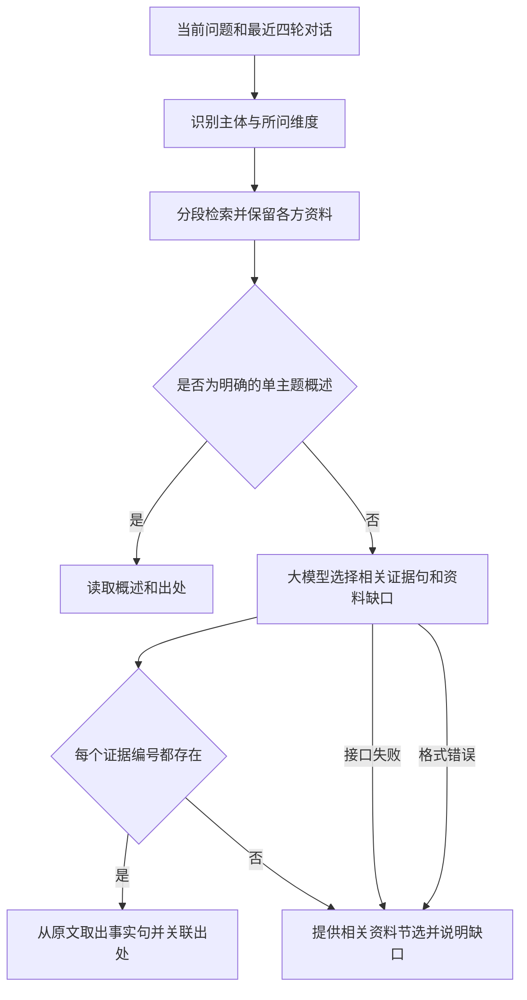

# 资料问答工作流

本轮修订依据甲方“答非所问”的反馈和真实接口测试。旧流程在关键词命中后直接返回整条答案，还为少数比较问句维护手写分支；复杂问题实际没有进入资料选择过程。

检索对标题、正文和关键词作去重的中文短语匹配，使用词频权重，并按工具、材料、工序、传习、寓意和名录等维度排序。明确主题约束资料范围；每个比较对象先保留相关段落，再补充其他证据。相关主题由资料元数据声明，不能把扎染、蓝印花布或土楼直接当成客家蓝染、围屋的同义名称。

资料按句编号，模型只返回与问题相关的证据编号。程序检查编号并从已检索原文取出对应事实句，按条目组织和去重；不直接展示模型写出的转述、年龄、温度或其他事实。资料缺口只展示问题原文中确实出现的对象、细节，其他缺口文字改为一般不足说明，避免缺口字段夹带未经证实的断言。网页不使用 reasoning_content，出处按实际使用的资料句关联。接口、格式或证据编号失败时提供节选，不把节选说成完整比较结论。

真实接口测试发现，“生成候选答案再让模型复核”仍会漏过地区泛化和无依据细节，因此最终采用原文事实句呈现。单次问题通常只需一次模型选择请求，保留最近四轮对话以理解追问，降低连续两次请求带来的等待时间。

默认采用 Qwen3-30B-A3B-Instruct-2507，证据选择请求由代理固定为JSON输出。旧的7B模型在实测中会把单个地区的做法泛化到所有地区，DeepSeek-V3.2则多次超时；[SiliconFlow官方模型页](https://www.siliconflow.com/models/qwen3-30b-a3b-instruct-2507)确认新的指令模型仅使用非思考模式并支持JSON模式。每次请求限20秒，所有失败路径都有资料兜底。

后台保留模型、温度与输出上限设置，自由系统提示词入口改为资料规则说明；不用讲解口吻、固定回答长度等旧提示干扰证据选择。共同点问法只选各方同一特征的证据，异同问法可选择各方不同做法，不维护某一对地区的手写答案。

DeepSeek-V3.2仍作为可选模型，代理固定 `enable_thinking: false`；浏览器不能提交任意上游字段。该参数依据[SiliconFlow官方模型说明](https://www.siliconflow.com/zh/blog/deepseek-v3-2-now-on-siliconflow-reasoning-first-model-built-for-agents)核对。路由设计参考[Haystack官方路由文档](https://docs.haystack.deepset.ai/docs/routers)，实现保留项目已有静态架构，无新增框架依赖。

用户下载的文章按正文页码整理，作者的象征分析与照片可见事实分别表述。《非遗.docx》前三个主题拆成可检索的工具、工序和传习段落；茶果章节排除。年龄冲突、24道染制工序未逐项列明、照片没有背面实测等限制明确写入资料。

程序检查能确认事实句来自已收录资料，防止模型自行补写事实；模型仍可能选到关联不充分的句子，原始资料本身也可能有遗漏或错误。这不能替代对资料质量和回答相关性的人工核对。真实接口测试专门覆盖跨工艺比较、年龄、工序温度、国外比较及连续追问。
