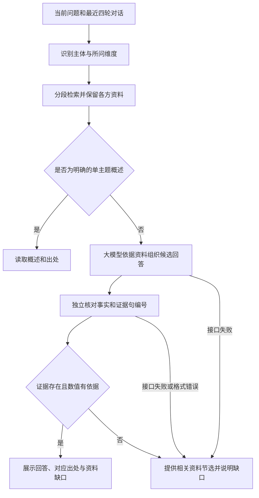

# 资料问答工作流

本轮修订依据甲方“答非所问”的反馈和真实接口测试。旧流程在关键词命中后直接返回整条答案，还为少数比较问句维护手写分支；复杂问题实际没有进入资料整理过程。

检索对标题、正文和关键词作去重的中文短语匹配，使用词频权重，并按工具、材料、工序、传习、寓意和名录等维度排序。明确主题约束资料范围；每个比较对象先保留相关段落，再补充其他证据。相关主题由资料元数据声明，不能把扎染、蓝印花布或土楼直接当成客家蓝染、围屋的同义名称。

资料按句编号。第二次模型请求核对候选答案，返回每段对应的证据编号和不能核实的内容；程序从已提供资料取出原句，核对编号、数值及响应是否完整。网页仅展示回答正文，不使用 reasoning_content，也不将“无法核实”当作失败再换成无关答案。出处按实际使用的资料句关联。接口或核对失败时明确提供节选，不把节选说成完整比较结论。

代理对 DeepSeek-V3.2 使用 `enable_thinking: false`，避免默认推理过程耗尽交互时间；浏览器仍不能提交任意上游字段。每次请求限20秒，所有失败路径都有资料兜底。该参数依据[SiliconFlow 官方模型说明](https://www.siliconflow.com/zh/blog/deepseek-v3-2-now-on-siliconflow-reasoning-first-model-built-for-agents)核对。路由设计参考[Haystack 官方路由文档](https://docs.haystack.deepset.ai/docs/routers)，实现保留项目已有静态架构，无新增框架依赖。

用户下载的文章按正文页码整理，作者的象征分析与照片可见事实分别表述。《非遗.docx》前三个主题拆成可检索的工具、工序和传习段落；茶果章节排除。年龄冲突、24道染制工序未逐项列明、照片没有背面实测等限制明确写入资料。

程序检查能确认引用是否存在、数值是否有来源，语义核对仍由模型完成；它不能保证所有解释都准确，也不替代对原始资料的人工核对。真实接口测试专门覆盖跨工艺比较、年龄、工序温度、国外比较及连续追问。
